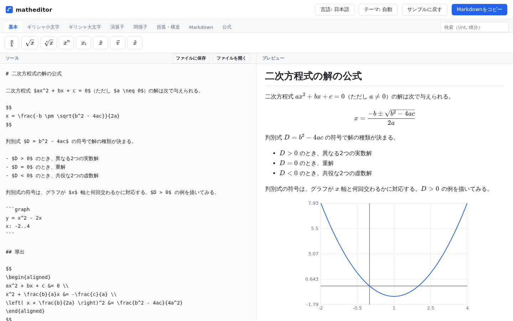
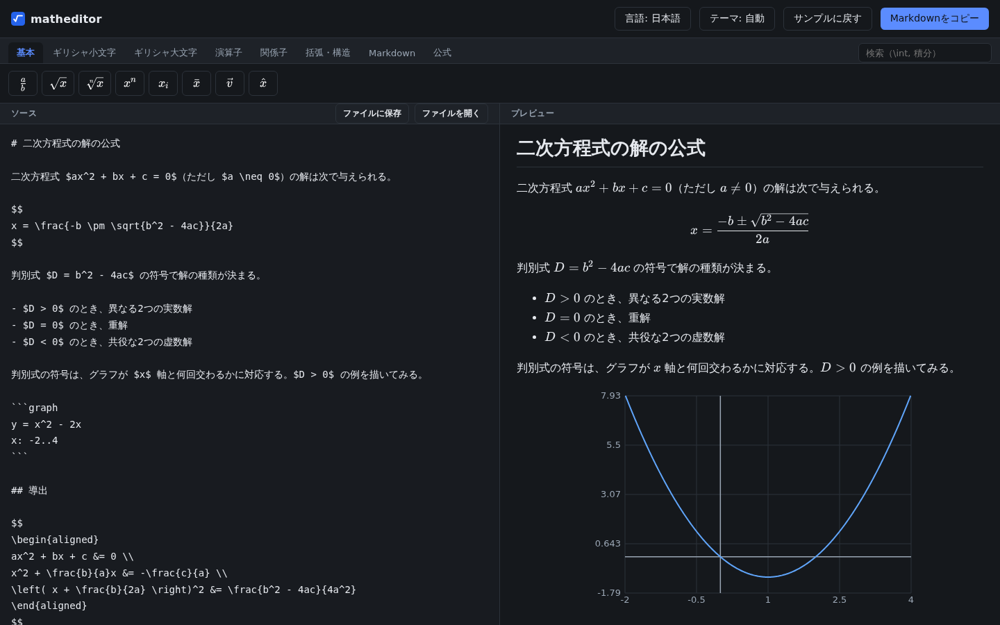
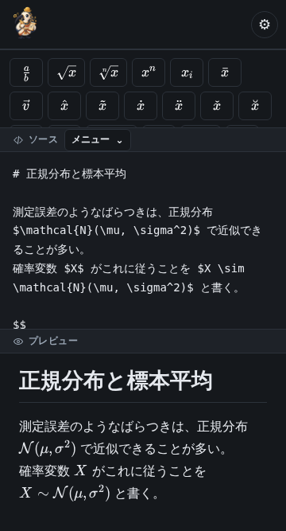

# ThothGlyph

**ThothGlyph**（トトグリフ）は、数式入りのMarkdownを書くためのWebエディタ。
左にMarkdownを書くと、右に数式まで描かれた形ですぐ出る。記号や公式は
パレットから選んで入れられるので、LaTeXのコマンドを覚えていなくても書ける。
書いたものはブラウザに自動で残り、`.md` ファイルとして保存できる。



## できること

| 機能 | どう動くか |
|---|---|
| **リアルタイムプレビュー** | 打つそばから右側が組み上がる。長い文書でも入力が重くならない |
| **数式** | `$x^2$` は文中に、`$$...$$` は行を独立させて描く（描画はKaTeX） |
| **記号パレット** | 記号7グループ150個。ボタンを押すとカーソル位置に挿入される |
| **公式の挿入** | 15分類75件。高校数学から統計・確率・集合と論理まで、式を見ながら選べる |
| **関数のグラフ** | ` ```graph ` に `y = x^2 - 2x` と書くと、プレビューにグラフが描かれる |
| **横断検索** | パレットの検索欄に打つと、タブをまたいで記号と公式が絞り込まれる |
| **文書内の検索・置換** | `Ctrl+F` か `検索` ボタン。`\alpha` を `\beta` に一括置換でき、`Ctrl+Z` 1回で戻せる |
| **自動保存** | 入力が止まると保存され、次に開いたときは続きから書ける |
| **ファイルを開く** | 手元の `.md` を、ボタンかドラッグ＆ドロップで読み込む |
| **ファイルに保存** | 編集中の内容を `.md` として保存する。名前は先頭の見出しから付く |
| **コピー** | ソース全文をクリップボードへ入れる |
| **ダークモード** | ふだんはOSの設定に従う。手動でも選べ、選んだテーマは次回も残る |
| **日本語 / English** | 画面の文言を切り替える。書いた文書は翻訳されない |
| **狭い画面** | 幅360pxのスマートフォンでも、ボタンが画面からはみ出さない |

## 書き方

数式は、文中なら `$x^2$`、行を独立させるなら `$$...$$` で囲む。
それ以外は普通のMarkdownで、見出し・箇条書き・表・コードブロックがそのまま使える。
コードブロックの中の `$` は数式にならないので、**LaTeXの記法そのものを説明する
文書も書ける**。

関数のグラフは、コードブロックの言語名を `graph` にして書く。

````
```graph
y = x^2 - 2x
x: -3..5
```
````

`y = ...` の行は3本まで並べられ、色を変えて重ね描きされる。`x:` で横の範囲を、
`y:` で縦の範囲を指定できる（`y:` を書かなければ自動で決まる）。
式には `+ - * / ^`、`sin` `cos` `tan` `sqrt` `abs` `exp` `log`、`pi` `e` が使える。
`#` で始まる行はコメント。**このエディタの外へ持ち出すとグラフにはならず、
書いた式がコードブロックとして残る。**

記号はパレットのボタンから入れる。タブは `基本` `ギリシャ小文字` `ギリシャ大文字`
`演算子` `関係子` `括弧・構造` `Markdown` `公式` の8つ。
タブを探さなくても、右端の検索欄に文字を打てばタブをまたいで見つかる
（`積分` でも `\int` でも見つかる）。

文字を選んでからパレットのボタンを押すと、**選んだ文字が記号の中に入る**
（`x + 1` を選んで `√` を押すと `\sqrt{x + 1}` になる）。
`公式` タブには、解の公式や三角関数の加法定理などが分類ごとに並ぶ。

## 保存と持ち出し

入力が止まると自動で保存され、ツールバーに `保存しました 12:34` と出る。
次に開いたときは続きから書ける。保存先はブラウザの中だけで、サーバには送らない。

**外へ持ち出す**方法は2つ。`ファイルに保存` を押すと `.md` としてダウンロードされ、
`Markdownをコピー` を押すとソース全文がクリップボードに入る。

**外から持ち込む**方法は、`ファイルを開く` から選ぶか、`.md` をソース欄へ
ドラッグ＆ドロップするか。どちらも、いま書いている内容を置き換える前に確認が出る。

## 表示

テーマははじめOSの設定に従う。`テーマ:` のボタンを押すたびに
`自動 → ライト → ダーク` と巡り、選んだテーマは次に開いたときも残る。
`言語:` のボタンでは日本語と English を切り替えられる。切り替わるのは画面の文言だけで、
書いた文書はそのまま残る。

スマートフォンの幅では、ソースとプレビューが上下に並び、パレットの高さにも
上限がつく。幅360pxでもボタンは画面からはみ出さない。

| ダーク | スマートフォン（幅360px） |
|---|---|
|  |  |

## 名前

**ThothGlyph**（トトグリフ）は、**Thoth**（トト）と **glyph**（グリフ）を
合わせた名前。

トトはエジプト神話の神で、**文字を発明したとされる書記の守護神**であり、
同時に**計算と測量と暦の神**でもある。月の満ち欠けを数えて時を刻み、
神々の裁きを書き留める。プラトンの『パイドロス』にも、文字を発明して
王に献じた「テウト」として出てくる。**書くことと数えることが、
一柱の神に同居している。**

glyph は字形、記号そのもの。語源はギリシャ語 γλύφω（gluphō ＝ 刻む）で、
**刻まれた記号**を指す。トトが与えたとされる聖刻文字は、エジプト語で
medu netjer ＝「神の言葉」という。

数式もまた記号の体系で、書くことと数えることが交わるところにある。
このエディタで利用者がしているのは、パレットからグリフを選んで並べること
（記号150個、公式75件）。名前はその操作をそのまま指している。

表記は `ThothGlyph`。日本語で書くときは「トトグリフ」。

## 手元で使う

サーバもアカウントも要らない。ビルドして出てきたファイルを開くだけで動く。

| やり方 | 手順 | 向いている場面 |
|---|---|---|
| **HTTPで配る** | `npm run build` → `npm run preview`（http://localhost:4173） | ふつうに使うとき |
| **サーバなしで開く** | `npm run build:file` → `dist-file/` をコピーして `index.html` を開く | サーバを立てられない端末へ渡すとき |

`dist-file/` は**1.9 MB・69ファイル**で、KaTeXのフォントも入っているので
**ネットワークに繋がっていなくても動く**。このフォルダはリポジトリに入っているので、
**GitHubから落として `index.html` を開くだけでも使える**（ビルドしなくてよい）。

`dist/`（HTTPで配るほう）を `file://` で直接開いても動かない。本体が
ESモジュールとして読み込まれるため、`file://` では取得が拒否される。
そのために `build:file` を分けてある（[0074](docs/specs/0074-file-protocol.md)）。

**書いたものはブラウザに保存される。** 保存はオリジンごとに分かれるので、
`npm run preview`（ポート4173）で書いたものは別のポートでは見えない。
`file://` で開いた場合は**置き場所が変わっても同じ保存を共有する**ので、
2つのコピーを別々のノートとしては使えない。

## 開発

VSCodeで「Reopen in Container」を選んでdevcontainerを開き、`npm run dev` を実行すると
http://localhost:5173 で動く。READMEのスクリーンショットは
`node scripts/make-screenshots.mjs` で撮り直せる。
開発の進め方は [CLAUDE.md](CLAUDE.md)、仕様とissueは [docs/](docs/) にある。
